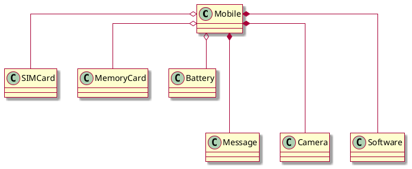

# Gráficos de relaciones



---

# Composición

> ***Yo creo y conservo las referencias***

Un objeto está instanciando a otros objetos dentro de su propio código.

En tu diagrama UML dices que Mobile está compuesto por Message, Camera y Software. Eso significa que en algún lado, dentro del cuerpo de la clase Mobile (o sea, dentro de su código) están escritas las líneas `new Message()`, `new Camera()` y `new Software()`. Por ejemplo:

```csharp
public class Mobile
{
    Message message = new Message();    //Compuesto por Message
    Camera camera;
    Software software;

    public Mobile()
    {
        camera = new Camera();          //Compuesto por Camera
    }

    public void inicializarSoftware()
    {
        software = new Software();      //Compuesto por Software
    }

    class Software { }
}
```

Es independiente de si las otras clases están anidadas o no. Si dentro del código de un objeto creas una instancia de otro (usando `new`), entonces el primer objeto está compuesto por el segundo.

> Tomar esta definición con pinzas mientras no se lea lo siguiente.

## Explicación en detalle de las notas de tu gráfico

Cuando quieras instanciar un objeto de la clase Mobile (`m = new Mobile();`), dentro de esa instancia de tipo Mobile (objeto) que se encuentra siendo referenciado por la variable `m`; se encuentran las referencias a las instancias de los objetos Message, Camera y Software (en las variables privadas message, camera y software). Por lo tanto, cuando pierdas la referencia a esa instancia de Mobile, no deberías poder acceder tampoco a las referencias de las instancias de Message, Camera y Software que se encontraban dentro.

Suponiendo que ahora elimino la única referencia que tengo al objeto Mobile (Una forma podría ser m = null;), lo que ocurriría normalmente, es que el recolector de basura (Garbage Collector), detectaría que ya no hay formas de acceder a esa instancia de Mobile, por lo tanto destruiría la misma eliminándola de memoria. A su vez, como nadie más tiene referencias a las instancias de Message, Camera y Software que se encontraban dentro, entonces se destruyen también.

Sin embargo, hay un detalle muy importante a tener en cuenta:

## ¿Qué pasa si mi objeto Mobile está entregando las referencias de Message, Camera o Software a otros?

Por ejemplo:

```csharp
public class Mobile
{
    public Message message = new Message(); //Referencia pública
    Camera camera = new Camera();

    public getCamera()
    {
        return camera;                      //Entregando referencia
    }

    public Software crearSoftware()
    {
        return new Software();
    }
}
```

En este escenario, ¿Mobile está compuesto por Message, Camera y/o Software? Ahora se cuenta con la libertad de hacer algo como esto:

```csharp
public static void Main()
{
    Mobile m = new Mobile();
    Message msg = m.message;
    Camera c = m.getCamera();
    m = null; // *------------=> Prestar atención ahora...
    // Más código.
}
```

Ahora cuando elimino la única referencia a mi instancia de Mobile, estoy destruyendo a ese objeto. Sin embargo, si quiero ver el contenido de las variables `msg` y `c`, después de haber destruido a mi objeto Mobile, se puede ver que siguen referenciando a los mismos objetos Message y Camera al que mi objeto Mobile contenía.

En este caso; a pesar que dentro de la clase Mobile se están instanciando a otros objetos, en ningún caso existe composición.

*Por lo tanto*:

**Composición:** Un objeto A está compuesto por un objeto B, siempre que se cumpla que todas las referencias a las instancias de B creadas por A, se destruyen antes o durante la destrucción de A.

---

# Agregación

> ***Yo recibo y conservo las referencias***

Un objeto tiene como atributos a otros objetos, que fueron pasados como parámetros.

En tu diagrama UML dices que Mobile está agregando a Battery, Simcard y Memorycard.

> Eso significa que dentro del cuerpo de la clase Mobile se definen atributos del tipo `Battery`, `Simcard` y `Memorycard`. Y que `Mobile` **NO** es quien tiene la responsabilidad de ***instanciar*** esos objetos.
> *Solamente guarda las referencias a esos objetos luego de haberlas recibido de alguna forma como parámetros*.

Por ejemplo:

```csharp
public class Mobile
{
    Battery battery;
    Simcard simcard;
    Memorycard memorycard;

    public Mobile(Battery parametroBattery)
    {
        battery = parametroBattery;     // Agregando a Battery
    }

    public void algunMetodo(Simcard parametroSimcard, Otro otroObjeto)
    {
        simcard = parametroSimcard;     // Agregando a Simcard
        memorycard = otroObjeto.getMemoryCard();
        // Agregando MemoryCard solo si getMemoryCard() devuelve una.
    }
}
```

Mobile no está instanciando ningún objeto. Solo recibe instancias como parámetros. Esto lo harías por ejemplo:

```csharp
public static void Main()
{
    Battery battery = new Battery();
    Mobile mobile = new Mobile(battery);

    Simcard simcard = new Simcard();
    Otro otroObjeto = new Otro();
    mobile.algunMetodo(simcard, otroObjeto);
    // Más código...
}

public class Otro
{
    public Memorycard getMemoryCard()
    {
        return new Memorycard();
    }
}
```

Ahora, si decides en algún momento escribir dentro del `Main()`, algo como `mobile = new Mobile(new Battery());`, la variable `mobile` ahora estará referenciando a una nueva instancia de `Mobile` mientras que la vieja instancia ya quedó destruida para siempre. Pobre de ella 😔. Sin embargo, al igual que antes, cuando exponías las referencias de tus objetos, si decides ver el contenido de `battery` por ejemplo, la misma vieja batería seguirá existiendo.

Está de más decir que en el caso opuesto, tengo la libertad de destruir la instancia de Battery y seguir manteniendo una referencia a un objeto vivo de Mobile. La destrucción de uno no significa la destrucción del otro.

*Por lo tanto*:

**Agregación:** Un objeto A está agregando a un objeto B, siempre que se cumpla que A mantiene una referencia a una instancia de B que puede evitar ser destruida durante la destrucción de A.

> **Nota:** Sin embargo, este tipo de asociación, no suele tener una definición estricta. Por lo cual es normal que la interpretación de la misma difiera entre desarrolladores. Esta presentada acá, es la interpretación que pude tener sobre este concepto. Y mantiene la idea que se suele tener al respecto; si se destruye un objeto, no necesariamente se destruye el otro.

---

# Asociación

> ***Yo creo y entrego las referencias***

```csharp
// Contraejemplo usado en la explicación de Composición
public class Mobile
{
    public Message message = new Message();
    Camera camera = new Camera();

    public getCamera()
    {
        return camera;
    }

    public Software crearSoftware()
    {
        return new Software();
    }
}
```

¿Qué pasa en el caso del método `crearSoftware` usado en el contraejemplo de composición? `Mobile` no se encuentra manteniendo ninguna referencia hacia los objetos `Software` que crea.

```csharp
// Ejemplo usado en la explicación de Agregación
public static void Main()
{
    Battery battery = new Battery();
    Mobile mobile = new Mobile(battery);
    Simcard simcard = new Simcard();
    Otro otroObjeto = new Otro();
    mobile.algunMetodo(simcard, otroObjeto);
}

public class Otro
{
    public Memorycard getMemoryCard()
    {
        return new Memorycard();
    }
}
```

¿Qué pasa en el caso del método `algunMetodo` con respecto a la clase `Otro` usado en el ejemplo de agregación? La clase `Otro` figura en el código de la clase `Mobile`, por lo tanto es claro que existe un tipo de relación entre ellos.

Existen asociaciones que no pueden ser clasificadas como asociaciones por composición o por agregación. Son solamente simples asociaciones. Y el único significado que expresan es que existe alguna dependencia (se conocen) entre los objetos involucrados.

Estas asociaciones pueden ser llamadas:

**Fuertes:** Cuando un objeto mantiene una referencia sobre el otro. En otras palabras, un objeto tiene como atributo al otro.

**Débiles:** Cuando un objeto simplemente conoce a otro sin mantener referencias con él.

Por lo tanto, se podría decir que las asociaciones entre objetos por composición y por agregación, son tipos de asociaciones fuertes. Mientras que en el caso de los métodos mencionados, crearSoftware y algunMetodo, son algunos ejemplos de asociaciones débiles.

Obviamente esto último depende de la interpretación que tengas con respecto a la asociación por agregación. Muchos difieren en la agregación que puede ser una asociación débil también.

# Resumiendo

**Composición:** Una instancia Mobile está compuesta por Message si todas las referencias a las instancias de Message creadas dentro de Mobile son destruidas cuando se destruye la instancia de Mobile.

**Agregación:** Una instancia de Mobile esta agregando a Battery si la instancia de Battery a la que está haciendo referencia la instancia de Mobile puede continuar existiendo cuando se destruye la instancia de Mobile.

**Asociación:** Una instancia de Mobile está asociado a Otro objeto, si es que dentro del código de Mobile aparece escrito Otro objeto. (Por lo tanto, Mobile dependería de Otro objeto).
